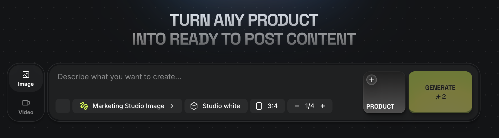
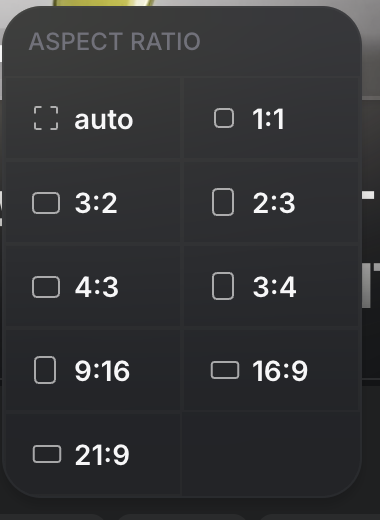
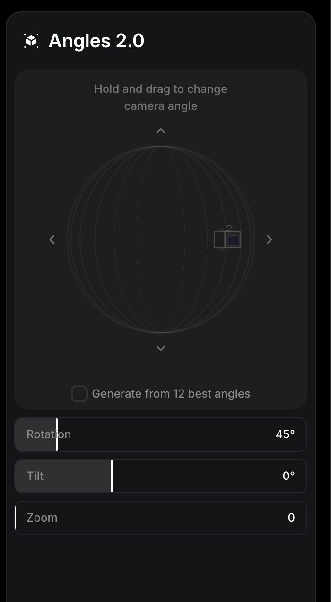

# Mockup Studio docs

Planning documents for **Future Mockup Studio** (working name), an image studio with two tabs, **Product** and **Model**. You pick a product or a person, choose a setting, ratio and camera angle, and get 1, 2 or 4 finished still images, without writing a prompt.

> **Status: planning.** The PRD and plan are a complete proposal dated 29 September 2026. No application code exists yet. Nothing in these documents has been benchmarked, and every timing, quality threshold and engine choice is a proposal to validate.

## Start here

Read in this order:

1. **[PRD](superpowers/specs/2026-09-29-future-mockup-studio-design.md)**: what the product does and how we'll know it works. Requirements R01–R15, journeys, UI, catalogs, camera angles, online/offline rules, architecture and acceptance gates.
2. **[Implementation plan](superpowers/plans/2026-09-29-future-mockup-studio.md)**: 11 tasks across 4 milestones, with the shared TypeScript contracts, the HTTP API, the proposed file layout and the tests that prove each task.
3. **[Research and decisions](research/sources-and-decisions.md)**: sources behind the engine candidates, what was and wasn't verified, and why each major decision was made.

## Folder map

```text
docs/
├── README.md                         this file
├── references/                       UI reference screenshots
│   ├── marketing-composer.png        compact composer: prompt, settings, source tile, Generate
│   ├── aspect-ratios.png             the nine ratio options in a two-column grid
│   └── angle-controls.png            camera orbit guide with Rotation, Tilt and Zoom
├── research/
│   └── sources-and-decisions.md      evidence log: engine candidates, sources, decision table
└── superpowers/
    ├── specs/
    │   └── 2026-09-29-future-mockup-studio-design.md    PRD
    └── plans/
        └── 2026-09-29-future-mockup-studio.md           implementation plan
```

`superpowers/` follows the Superpowers skill convention: specs say *what* to build, plans say *how*, and both are named `YYYY-MM-DD-<topic>.md`.

## The product at a glance

### Two tabs, one composer

|  | Product | Model |
|---|---|---|
| **Source** | Upload a photo or choose a saved product | Upload a photo of a person, or select a model from a curated, licensed or synthetic catalog |
| **Filters** | None | Skin tone (Tone 1–10), gender presentation (Any, Female, Male), age group (Kid, Teen, Young adult, Middle-aged, Older adult) |
| **Backgrounds** | 6: Studio white, Seamless Monochromes, Minimalist Podiums, Natural Outdoor, Aesthetic Indoor Space, Natural Outdoor Environment | 7: Studio white, Seamless Monochromes, Corporate office, Cafe, Natural Outdoor, Aesthetic Indoor Space, Natural Outdoor Environment |

Both tabs share these controls:

- **Ratio:** Auto, 1:1, 3:2, 2:3, 4:3, 3:4, 9:16, 16:9, 21:9. The subject is never stretched or silently cropped.
- **Angle:** seven presets (Original, Front, Three-quarter left/right, Left/Right profile, Top-down) or a custom orbit with Rotation (±180°), Tilt (±90°) and Zoom (±50).
- **Prompt:** optional, up to 2,000 characters. When the text conflicts with a control, the control wins.
- **Count:** 1, 2 or 4 images. This is the total, with one camera angle per batch.

Defaults: Product tab, Auto ratio, Studio white, Original angle, empty prompt, 1 image. Each tab keeps its own draft.

### Where images are made

| Mode | How it works | First candidate engine |
|---|---|---|
| **Cloud** | Authenticated server calls one image API | OpenAI `gpt-image-2.5-sunburst` |
| **On this device** | Paired local companion (Python, loopback only) runs an installed model | FLUX.2 Klein 4B (Apache-2.0) |
| **Offline, no local engine** | Edit and save projects, queue cloud jobs; on reconnect, **Review and send** | None |

A local job never falls back to the cloud, and reconnecting never sends paid work without review. Engine candidates are untested. M0 qualifies them before the build commits to either.

### Proposed stack

An installable React + TypeScript + Vite web app (service worker + IndexedDB), a Node/TypeScript cloud API with a SQL job store and private object storage, and a Python local companion. Vitest, Playwright and pytest cover testing. Dependency versions are pinned at kickoff.

### Roadmap

| Milestone | Tasks | Outcome | Estimate |
|---|---|---|---|
| M0 Feasibility | 1 | Engines, hardware and browser-to-companion transport qualified | 3–5 working days |
| M1 Cloud pilot | 2–8 | Complete two-tab UI, real cloud results, offline drafts and queue | 10–15 working days |
| M2 Offline v1 | 9–10 | Installed engine generates new images with the network off | 7–12 working days |
| M3 Release | 11 | Usability, accessibility, recovery, quality and cost evidence | 3–5 working days |

The plan estimates roughly 5–8 calendar weeks with two full-stack engineers plus part-time ML, design and QA support. This is an estimate, not a commitment.

**Outside v1:** video, animation, 3D reconstruction, virtual try-on, a product and a person in one scene, bulk catalogs, teams, social publishing, a template marketplace, custom model training, and the "12 best angles" pack.

### Open decisions

These are carried as proposals from PRD §15:

- The first supported local device class (settled in M0).
- Whether the two outdoor background labels are distinguishable (usability test).
- Age bands and catalog coverage for every filter value.
- Hosted cloud billing versus bring-your-own-key access, before a commercial launch.

## References

These screenshots are functional references for layout and controls. They are not styling to reproduce, assets to reuse, or evidence of an available API.

**Composer**



**Aspect ratio picker** · **Camera angle controls**

 

## Adding documents

The plan names documents to write during the build. Put them here:

| Path | Written in |
|---|---|
| `decisions/engine-and-device.md`, `decisions/local-transport.md` | Task 1 (M0) |
| `local-setup.md` | Task 10 |
| `quality/release-checklist.md`, `quality/benchmark-report.md` | Task 11 |
| `operations/runbook.md`, `operations/data-retention.md` | Task 11 |

New specs and plans go in `superpowers/specs/` and `superpowers/plans/`, named `YYYY-MM-DD-<topic>.md`.

## Known gaps

- `research/sources-and-decisions.md` links to three skill files (brainstorming, writing-plans, imagegen) by absolute paths on the author's machine. Those links don't open on GitHub.
